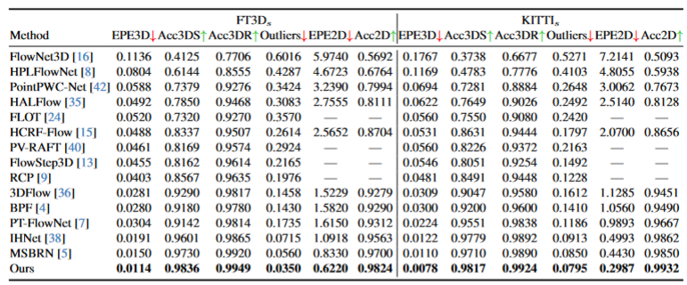
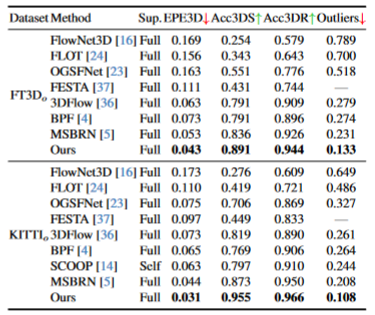

# DifFlow3D: Toward Robust Uncertainty-Aware Scene Flow Estimation with Iterative Diffusion-Based Refinement
Jiuming Liu, Guangming Wang, Weicai Ye, Chaokang Jiang, Jinru Han, Zhe Liu, Guofeng Zhang, Dalong Du, Hesheng Wang#

Proceedings of the IEEE/CVF Conference on Computer Vision and Pattern Recognition (CVPR), 2024

## 📣 News
- **[19/Mar/2024]** We have released our models and checkpoints based on MSBRN!
- **[27/Feb/2024]** Our paper has been accepted by **CVPR 2024**! 🥳🥳🥳
  


## Environments
Our model is trained and tested under:
* Python 3.6.9
* NVIDIA GPU + CUDA CuDNN
* PyTorch (torch == 1.6.0)
* scipy
* tqdm
* sklearn
* numba
* cffi
* pypng
* pptk
* thop

Please follow the instructions below for compiling the furthest point sampling, grouping and gathering operation for PyTorch.
```
cd pointnet2
python setup.py install
cd ../
```


## Data preprocess

We adopt the equivalent preprocessing steps in [HPLFlowNet](https://web.cs.ucdavis.edu/~yjlee/projects/cvpr2019-HPLFlowNet.pdf) and [PointPWCNet](https://github.com/DylanWusee/PointPWC).

* FlyingThings3D:
Download and unzip the "Disparity", "Disparity Occlusions", "Disparity change", "Optical flow", "Flow Occlusions" for DispNet/FlowNet2.0 dataset subsets from the [FlyingThings3D website](https://lmb.informatik.uni-freiburg.de/resources/datasets/SceneFlowDatasets.en.html) (we used the paths from [this file](https://lmb.informatik.uni-freiburg.de/data/FlyingThings3D_subset/FlyingThings3D_subset_all_download_paths.txt), now they added torrent downloads)
. They will be upzipped into the same directory, `RAW_DATA_PATH`. Then run the following script for 3D reconstruction:

```bash
python3 data_preprocess/process_flyingthings3d_subset.py --raw_data_path RAW_DATA_PATH --save_path SAVE_PATH/FlyingThings3D_subset_processed_35m --only_save_near_pts
```

* KITTI Scene Flow 2015
Download and unzip [KITTI Scene Flow Evaluation 2015](http://www.cvlibs.net/download.php?file=data_scene_flow.zip) to directory `RAW_DATA_PATH`.
Run the following script for 3D reconstruction:

```bash
python3 data_preprocess/process_kitti.py RAW_DATA_PATH SAVE_PATH/KITTI_processed_occ_final
```

### Evaluation
Set `data_root` in the configuration file to `SAVE_PATH` in the data preprocess section before evaluation. 

We provide pretrained model in ```pretrain_weights```.
- `model_difflow_355_0.0114.pth`: checkpoints for flt3d_s and KITTI_s.
- `model_difflow_occ_327_0.0428.pth`: checkpoints for flt3d_o and KITTI_o.

Please run the following instrcutions for evaluation.
- For flt3d_s and KITTI_s
    ```bash
    python3 evaluate.py config_evaluate.yaml
    ```
- For flt3d_o and KITTI_o
    ```bash
    python3 evaluate_occ.py config_evaluate_occ.yaml
    ```


  
### Train
If you want to train from scratch, please set `data_root` in the configuration file to `SAVE_PATH` in the data preprocess section before evaluation at the first. Then excute following instructions.

- For flt3d_s and KITTI_s
    ```bash
    python3 train_difflow.py config_train.yaml
    ```
- For flt3d_o and KITTI_o
    ```bash
    python3 train_difflow_occ.py config_train_occ.yaml
    ```

### Quantitative results:
## without occlusion 


## with occlusion


## Citation
```
@article{liu2023difflow3d,
  title={DifFlow3D: Toward Robust Uncertainty-Aware Scene Flow Estimation with Diffusion Model},
  author={Liu, Jiuming and Wang, Guangming and Ye, Weicai and Jiang, Chaokang and Han, Jinru and Liu, Zhe and Zhang, Guofeng and Du, Dalong and Wang, Hesheng},
  journal={arXiv preprint arXiv:2311.17456},
  year={2023}
}
```
### Acknowledgments
We thank the following open-source project for the help of the implementations:
- [PointNet++](https://github.com/charlesq34/pointnet2) 
- [MSBRN](https://github.com/cwc1260/MSBRN)


